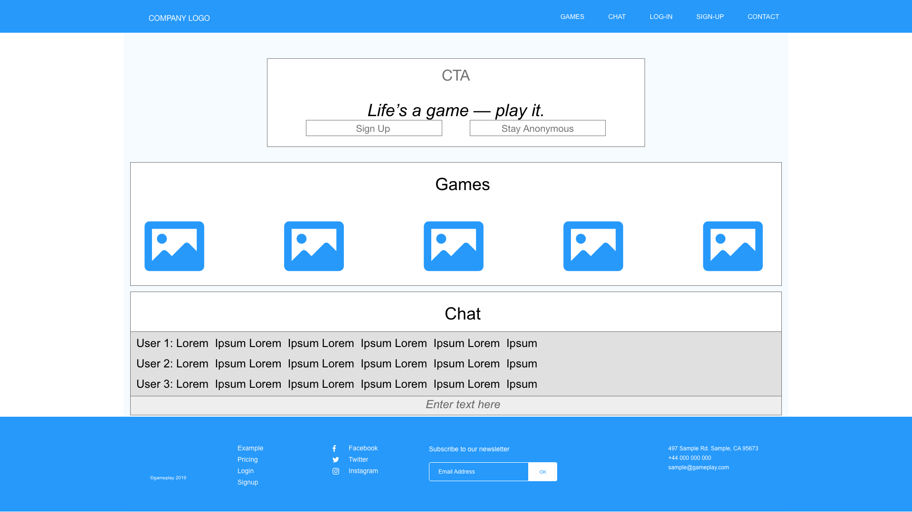
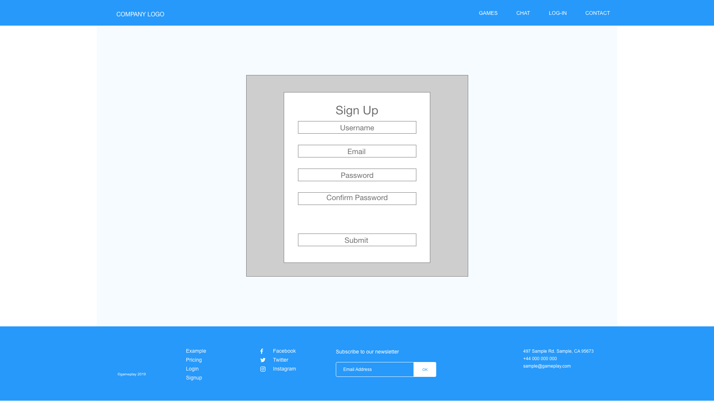
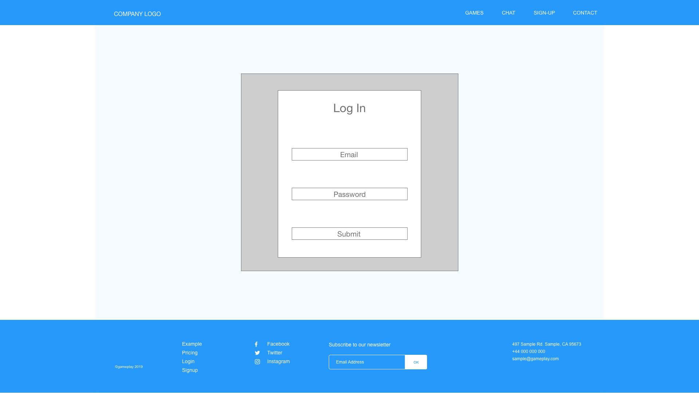
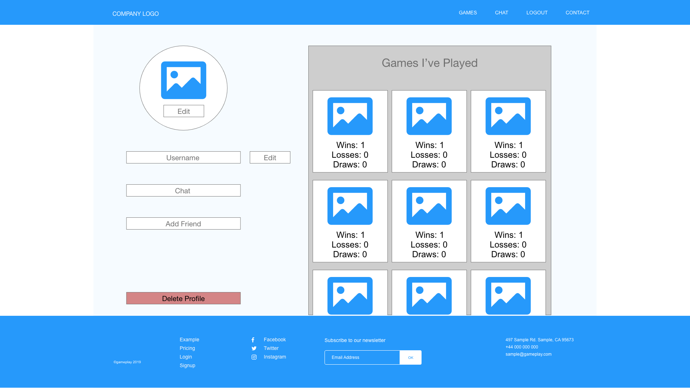
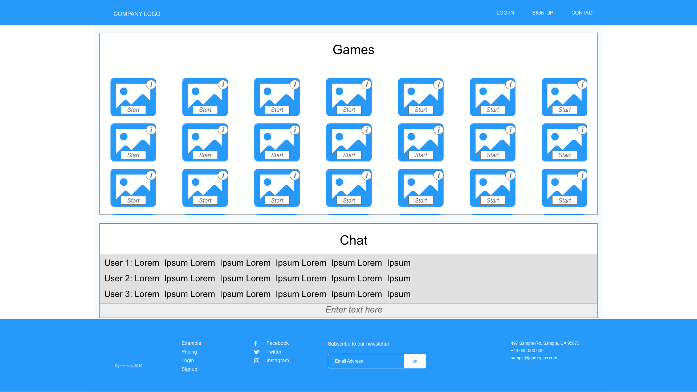
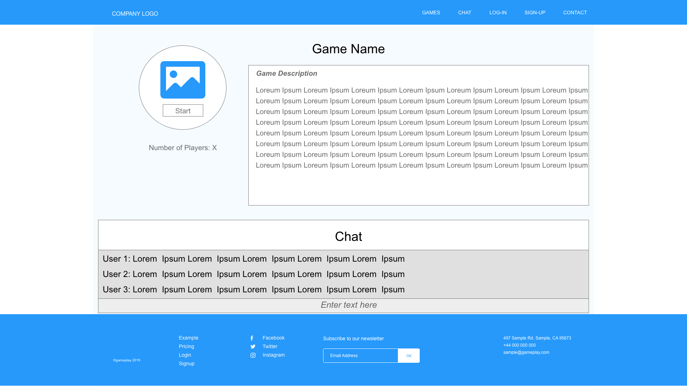
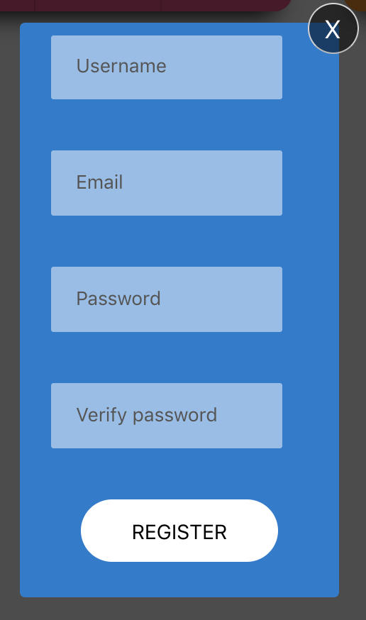
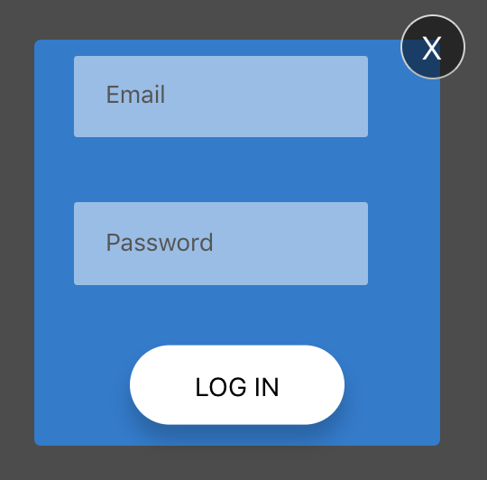
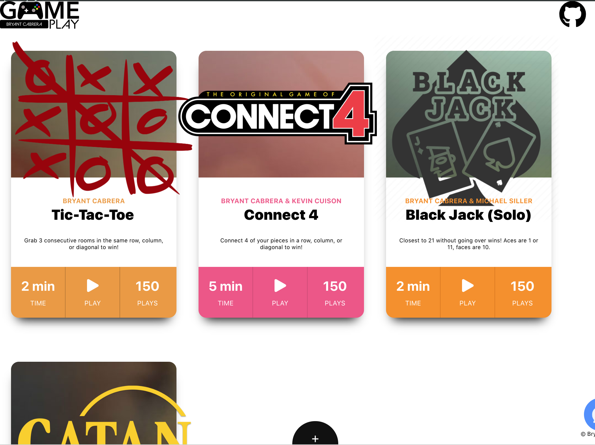

# Gameplay 


## A. Description
GamePlay is a MERN stack app that acts as a game hub/lounge for web socket games.  The app uses web sockets in iFrames to communicate between the GamePlay hub app and hosted games.

Link to deployed app: [https://bryant-gameplay.herokuapp.com/](https://bryant-gameplay.herokuapp.com/)
Link to GitHub repo (front-end): [https://github.com/BryantCabrera/gameplay-react](https://github.com/BryantCabrera/gameplay-react)

Link to deployed api: [http://bryant-gameplay-server.herokuapp.com/](http://bryant-gameplay-server.herokuapp.com/)
Link to GitHub repo (backend): [https://github.com/BryantCabrera/gameplay-express](https://github.com/BryantCabrera/gameplay-express)

Link to deployed Tic-Tac-Toe Socket Game: [https://bryant-tic-tac-toe.herokuapp.com/](https://bryant-tic-tac-toe.herokuapp.com/)
Link to Tic-Tac-Toe Socket Game GitHub repo: [https://github.com/BryantCabrera/tic-tac-toe-socket](https://github.com/BryantCabrera/tic-tac-toe-socket)

Link to deployed Settlers of Catan Game: [https://bryantcabrera.github.io/Settlers-of-Catan](https://bryantcabrera.github.io/Settlers-of-Catan)
Link to Settlers of Catan Game GitHub repo: [https://github.com/BryantCabrera/Settlers-of-Catan](https://github.com/BryantCabrera/Settlers-of-Catan)


Relocater's back-end features a Node & Express architecture with complete CRUD capabilities using RESTful routing.  The server uses bcrypt for authentication.  

```
GamePlay was built in 2 days by Bryant Cabrera
```

## B. User Stories
User: A web gamer of any age who enjoys playing short (less than 1.5 hr) games with other users in realtime.
```
As a user, I want to be able to check out some of the app's features without having to sign up.
```
```
As a user, I want to be able to sign in with secure authorization to store my play info.
```
```
As a user, immediately after signign up, I want to be directed to my profile to edit my current salary and current county to improve my user experience.
```
```
As a user, I want the app to save my play stats automatically as I finish games..
```
```
As a user, I want a responsive navigation bar that is available on every page because I want access to appropriate components of the app.
```
```
As a user, I don't want to have to check in again after each game ends.
```
```
As a user, I want to see other users play stats so I can see who is playing the same games I am.
```

## C. Images
1. Wireframe
    > 
    > 
    > 
    > 
    > 
    > 
    > 


## D. Technologies Used
> Front-End
    
    1. React
    2. React Router
    3. iFrame
    4. IframeComm npm package
    5. socket.io
    6. react-chat-elements: [https://www.npmjs.com/package/react-chat-elements](https://www.npmjs.com/package/react-chat-elements)
    7. BEM
    8. Google fonts
    Font Awesome Icons
    9. flaticon.com
    10. fetch

> Back-End

    1. node
    2. express
    3. mongoose
    4. mongoDB
    5. fetch
    6. socket.io
    7. mlab

> Authentication
    
    1. bcrypt

> Socket Games
  
    1. socket.io
    2. iFrames
    3. IframeComm
    4. jQuery
    5. BEM

> Planning/Organization/Design
    
    1. Adobe XD
    2. Adobe Photoshop
    3. Adobe Illustrator


## E. Getting Started
1. LOGGING IN: At the bottom center of the screen, toggle between Sign Up & Sign In.
    1. If you click Sign Up (the cash register icon), you can create a new account. 
        1.  Enter your email address and password.
            > 
        2.  You will then be redirected to your profile edit page where you can enter your other information.
    2. If you click Sign In, you can log into your account using your GamePlay account.
        > 
2.  Soon after, you will be redirected to a list of games.
4.  If you choose *__not__* to Sign Up or Log In, at the bottom center, you can click the game controller icon to navigate to the games index.  You can click on any game to play anonymously.
    > 
5.  You can view other users by clicking the icon of multiple people (2nd from the left) in the NavBar wheel.
6.  To log out, click the LogOut button on the NavBar wheel.


## F. Development workflow
1.	React  
    1. Clone repo from GitHub link
    2. cd to the project directory in your terminal and $npm install
    3. If deploying to heroku, make sure to create a .env.production file in your root directory and set a variable REACT_APP_API_URL={enter your back-end's deployed URL here without these curly braces}
2.	Node/Express
    1. Clone repo from GitHub link
    2. cd to the project directory in your terminal and $npm install
    3. If deploying to heroku, make sure to do the following
        1. include your deployed front-end's URL in corsOptions in server.js
        2. In heroku, set your DATABASE_URL variable in configurations equal to your database URL
            1. My database is hosted on mlab


## G. Next Steps
1. Unsolved problems
    - [ ] On refresh, the app state is lost
    - [ ] On routes other than /, the NavBar gets stuck behind the displayed component
    - [ ] Logging in with Google OAuth does not close socket pop-up card after choosing an account to log in with
2. Planned features
    - [ ] Include a search bar on the games and users indices
    - [ ] Authentication with other social media
        - [ ] Google
        - [ ] Facebook
        - [ ] Twitter
    - [ ] Include functioning chat app so users can easily give each other their game room codes